# Gemini 2.0 Flash Multimodal Live API Client Architecture

```mermaid
graph TB
    %% Main Components
    UI[Browser UI]
    Script[script.js]
    Agent[GeminiAgent]
    WSClient[WebSocket Client]
    
    %% Media Components
    AudioRec[Audio Recorder]
    AudioStr[Audio Streamer]
    AudioVis[Audio Visualizer]
    Camera[Camera Manager]
    Screen[Screen Manager]
    
    %% Supporting Components
    ChatMgr[Chat Manager]
    ToolMgr[Tool Manager]
    Config[Configuration]
    Transcriber[Deepgram Transcriber]

    %% External Services
    GeminiAPI[Gemini API]
    DeepgramAPI[Deepgram API]

    %% UI Interactions
    UI -->|User Input| Script
    Script -->|Display| UI
    
    %% Main Control Flow
    Script -->|Initializes| Agent
    Script -->|Manages| ChatMgr
    Script -->|Configures| ToolMgr
    
    %% Agent Interactions
    Agent -->|WebSocket Communication| WSClient
    Agent -->|Audio Recording| AudioRec
    Agent -->|Audio Playback| AudioStr
    Agent -->|Visualization| AudioVis
    Agent -->|Camera Control| Camera
    Agent -->|Screen Capture| Screen
    Agent -->|Transcription| Transcriber
    
    %% External Communications
    WSClient -->|Bidirectional Stream| GeminiAPI
    Transcriber -->|Speech-to-Text| DeepgramAPI
    
    %% Configuration
    Config -->|Settings| Agent
    Config -->|API Keys| WSClient
    Config -->|Model Settings| WSClient
    
    %% Tool Management
    ToolMgr -->|Function Calls| WSClient
    
    %% Chat Management
    ChatMgr -->|Messages| UI
    Agent -->|Updates| ChatMgr

    %% Subgraphs for logical grouping
    subgraph Media Processing
        AudioRec
        AudioStr
        AudioVis
        Camera
        Screen
    end
    
    subgraph Core Components
        Script
        Agent
        WSClient
    end
    
    subgraph Support Services
        ChatMgr
        ToolMgr
        Config
        Transcriber
    end

    %% Styling
    classDef core fill:#f9f,stroke:#333,stroke-width:2px
    classDef media fill:#bbf,stroke:#333,stroke-width:2px
    classDef support fill:#bfb,stroke:#333,stroke-width:2px
    classDef external fill:#fbb,stroke:#333,stroke-width:2px
    
    class Script,Agent,WSClient core
    class AudioRec,AudioStr,AudioVis,Camera,Screen media
    class ChatMgr,ToolMgr,Config,Transcriber support
    class GeminiAPI,DeepgramAPI external
```

## Component Descriptions

### Core Components
- **script.js**: Main entry point that initializes and coordinates all components
- **GeminiAgent**: Central orchestrator for real-time interactions and media handling
- **WebSocket Client**: Manages bidirectional communication with Gemini API

### Media Processing
- **Audio Recorder**: Captures and processes microphone input
- **Audio Streamer**: Handles audio playback from the model
- **Audio Visualizer**: Provides real-time audio visualization
- **Camera Manager**: Handles video capture and processing
- **Screen Manager**: Manages screen sharing functionality

### Support Services
- **Chat Manager**: Handles chat interface and message display
- **Tool Manager**: Manages function declarations and tool calls
- **Configuration**: Manages API keys, model settings, and user preferences
- **Transcriber**: Handles speech-to-text conversion via Deepgram

### External Services
- **Gemini API**: Provides AI model capabilities
- **Deepgram API**: Provides speech transcription services

## Data Flow

1. User interactions flow through the UI to script.js
2. script.js coordinates with core components to handle requests
3. GeminiAgent orchestrates media processing and communication
4. WebSocket Client maintains bidirectional streams with Gemini API
5. Support services provide auxiliary functionality:
   - Chat Manager handles message display
   - Tool Manager processes function calls
   - Configuration manages settings
   - Transcriber converts speech to text
6. Media components process real-time audio/video/screen data
7. External services provide AI model and transcription capabilities