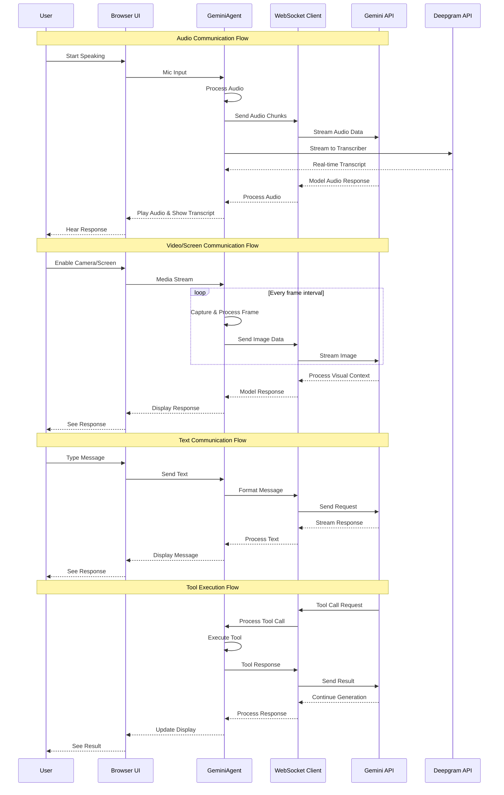

# Real-time Communication Flow

## Real-time Communication Flows

### Audio Communication
1. User audio is captured and processed in real-time
2. Processed audio is streamed to both Gemini API and Deepgram
3. Transcripts and model responses are received and displayed simultaneously
4. Model's audio response is played back in real-time

### Visual Communication
1. Camera/Screen content is captured at configured intervals
2. Each frame is processed and sent to Gemini API
3. Model processes visual context in its responses
4. Responses are displayed in real-time

### Text Communication
1. User text input is immediately processed
2. Messages are formatted and sent to Gemini API
3. Responses are streamed back in chunks
4. Text is displayed progressively as it's received

### Tool Execution
1. Model may request tool execution during response
2. Tool calls are processed and executed locally
3. Results are sent back to continue the conversation
4. Entire process happens seamlessly in the conversation flow