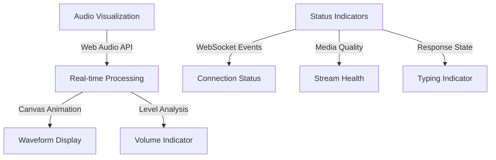
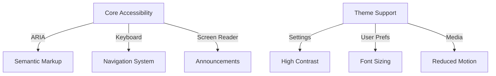
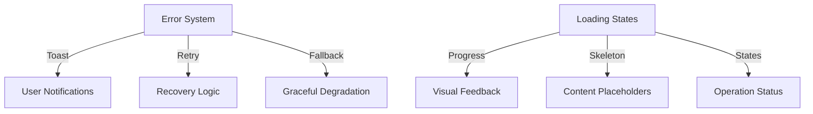

# Modification Plan for Jamie - Gemini Live App

## Implementation Phases

### Phase 1: Core Updates (Completed)
1. Updated app branding
2. Implemented response mode toggle
3. Added modern SVG icons
4. Enhanced configuration system

### Phase 2: Mobile Optimization (Completed)
1. Updated camera preview with inline chat integration
2. Implemented responsive design improvements
3. Enhanced mobile UX with better layouts
4. Added floating/inline preview toggle

### Phase 3: Real-time Interaction & Accessibility

#### 1. Real-time Visual Feedback


##### Implementation Steps:
1. Audio Visualization Enhancement
   - Create AudioContext for real-time processing
   - Implement smooth waveform animation
   - Add volume level indicators
   - Support different visualization styles

2. Status Indicators
   - Add WebSocket connection quality indicator
   - Implement typing indicator for model responses
   - Display media stream health metrics
   - Add toast notifications for status changes

#### 2. Accessibility Implementation


##### Implementation Steps:
1. Core Accessibility Features
   - Add ARIA labels and roles
   - Implement keyboard navigation
   - Add screen reader support
   - Create focus management system

2. Theme & Preference Support
   - Add high contrast mode
   - Implement font size controls
   - Support reduced motion
   - Add user preference persistence

#### 3. Error Handling & UX


##### Required Files:

1. New Files:
```
js/
  audio/
    visualizer/
      waveform.js      # Waveform animation
      analyzer.js      # Audio analysis
      renderer.js      # Canvas rendering
  accessibility/
    a11y.js           # Core accessibility
    keyboard.js       # Keyboard navigation
    announcer.js      # Screen reader support
  ui/
    toast.js          # Notification system
    loader.js         # Loading states
    status.js         # Status indicators
    error.js          # Error handling
  themes/
    manager.js        # Theme management
    contrast.js       # High contrast mode

css/
  components/
    visualizer.css    # Audio visualization
    toast.css         # Notifications
    loader.css        # Loading states
    status.css        # Status indicators
  themes/
    high-contrast.css # High contrast theme
    reduced.css       # Reduced motion
```

2. Modifications:
```
js/
  config/config.js           # Add accessibility settings
  settings/
    settings-manager.js      # Add theme controls
    settings-template.js     # Add accessibility UI
  audio/
    recorder.js             # Add visualization
  ws/
    client.js              # Add status tracking
  main/
    agent.js              # Add error handling
```

#### Technical Considerations:
1. Performance Impact
   - Optimize audio visualization for mobile
   - Use RequestAnimationFrame for smooth animation
   - Implement throttling for status updates

2. Browser Compatibility
   - Provide fallbacks for AudioContext
   - Support legacy ARIA attributes
   - Handle vendor-specific APIs

3. Resource Management
   - Proper cleanup of audio contexts
   - Memory-efficient animations
   - Efficient event handling

## Testing Requirements

1. Accessibility Testing
   - Screen reader compatibility
   - Keyboard navigation
   - Color contrast compliance
   - ARIA implementation

2. Performance Testing
   - Animation frame rate
   - Audio processing overhead
   - Memory usage monitoring
   - Mobile device impact

3. Cross-browser Testing
   - Visualization compatibility
   - Theme switching
   - Status indicator behavior
   - Error recovery

## Implementation Order

1. Core Framework
   - Set up accessibility system
   - Implement theme infrastructure
   - Add error handling framework

2. Visual Feedback
   - Implement audio visualization
   - Add status indicators
   - Create loading states

3. User Experience
   - Add keyboard navigation
   - Implement notifications
   - Enable theme switching

Would you like to proceed with any specific part of Phase 3's implementation?